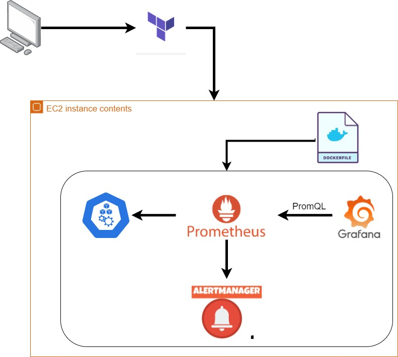

# Implementando uma Stack de Observabilidade com Prometheus na AWS usando Terraform e Docker

[Artigo Medium Implementação passo a passo]: (https://medium.com/@joaonxavier_mnt/stack-de-observabilidade-do-prometheus-usando-terraform-e-docker-670ffbb7c3cb)

